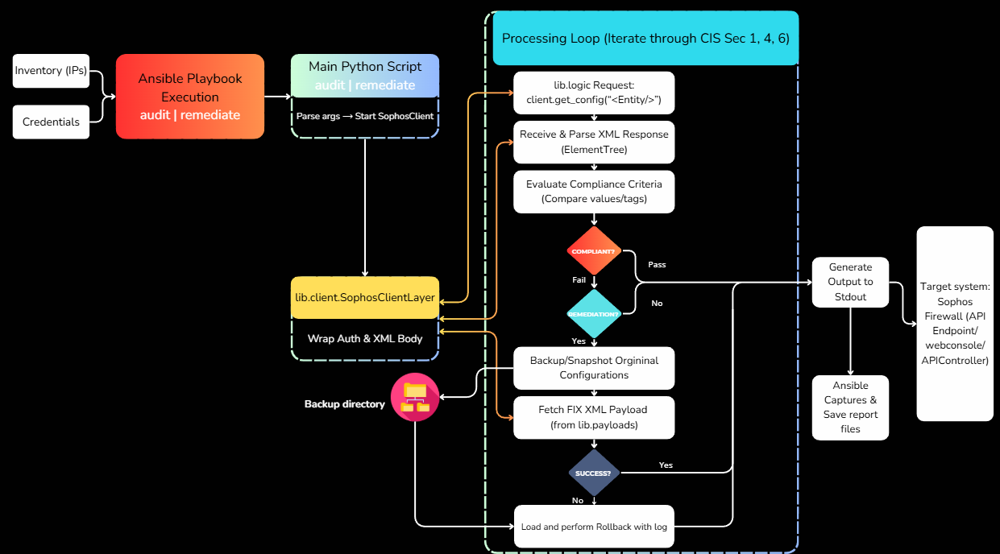

# Sophos Firewall Automated Audit and Remediation

## Project Overview
This project provides an automated solution for auditing and hardening Sophos Firewall (v21) configurations. By leveraging Python and Ansible, the system ensures that network security settings strictly adhere to CIS (Center for Internet Security) Benchmarks.

The project is divided into two main components:
1. Automated Audit: Scans the firewall via API to identify security misconfigurations.
2. Automated Remediation: Automatically applies secure configurations to fix identified vulnerabilities, with a built-in backup and rollback mechanism.

## Key Technical Features
- CIS Compliance Auditing: Covers critical security sections including Administrative Access, Password Policy, NTP synchronization, Pattern Updates, and DoS Protection.
- Automated Remediation: Uses predefined XML payloads to immediately harden non-compliant settings.
- Safety Mechanisms:
    - Snapshot Backup: Automatically exports current XML configurations before any changes are applied.
    - Verification and Rollback: Verifies the new state after remediation; if verification fails, the system automatically restores the previous configuration.
- Network Automation: Integrated with Ansible to manage multiple firewall nodes from a centralized management station.
- REST API Interaction: Securely communicates with Sophos Firewalls using XML-based API requests.

## Audited Security Controls (CIS Benchmarks)
- Section 1: Administrative Access
    - 1.1.1: Idle Timeout and Account Lockout.
    - 1.1.2: Login Disclaimer.
    - 1.1.5: Password Complexity (Min 10 chars, special characters).
    - 1.1.6: WAN Management Access Disabling.
- Section 4: System Protection
    - 4.2: Pattern Update Frequencies (Every 15 minutes).
    - 4.4: Automated Backup Schedules (External storage).
- Section 6: Network Security
    - 6.7: Spoof Prevention (LAN/DMZ).
    - 6.7: DoS Protection (SYN, UDP, TCP, ICMP Flood protection).
    - 6.9: Wireless Security (WPA2/AES with Client Isolation).
    - 6.10: WAN Any-Any Firewall Rule auditing.

## System Workflow and Logic

The following diagram describes the automated process for auditing and remediating security controls on the Sophos Firewall:

### 1. Execution and Initialization
- Orchestration: The process begins with an Ansible Playbook execution (audit or remediate), which provides the necessary inventory (target IPs) and credentials.
- Client Setup: The main Python script initializes the SophosClient layer, wrapping authentication details and preparing the XML body for API communication.

### 2. Processing Loop (CIS Sections 1, 4, and 6)
The system enters a processing loop to iterate through specific security controls defined in CIS Sections 1, 4, and 6:
- Data Retrieval: The logic layer sends a request to the firewall via `client.get_config` for a specific entity.
- Parsing: Received XML responses are parsed using the ElementTree library to extract current configuration values.
- Compliance Evaluation: The system compares extracted values against predefined CIS compliance criteria.

### 3. Decision Making and Remediation
- Compliant State: If the system is compliant, it proceeds directly to generating output.
- Non-Compliant State:
    - If remediation is not enabled, the system logs the failure and moves to the next control.
    - If remediation is enabled, the system performs the following safety steps:
        - Backup: Creates a snapshot of the original configuration and saves it to the backup directory.
        - Fix Application: Fetches the required FIX XML payload from the library and applies it to the firewall using `set_config`.
        - Verification: Evaluates if the fix was successful. If the update fails, the system automatically loads and performs a rollback using the previously saved snapshot.

### 4. Output and Reporting
- Standard Output: The results of each check and remediation action are printed to the console.
- Report Generation: Ansible captures the execution output and saves consolidated report files for administrative review.

## Technical Stack
- Languages: Python 3.12 (Requests, ElementTree)
- Automation Framework: Ansible
- Target OS: Sophos Firewall (SFOS v21)
- Configuration Formats: XML, YAML

## Project Structure
- main_audit.py: Core logic for scanning and reporting.
- main_remediate.py: Core logic for fixing and verification.
- lib/client.py: Sophos API Client implementation.
- lib/logic/: Verification functions for each CIS control.
- lib/payloads/: Secure XML configurations used for remediation.
- lib/backup_manager.py: Manages automated snapshots and session directories.
- backups/: Stores XML snapshots before remediation for safety.

## How to Run

### 1. Prerequisites
- Install Python dependencies: pip install requests python-dotenv
- Install Ansible on the management machine.
- Configure inventory.ini (or use inventory.example.ini as a template) with your Firewall IP and administrative credentials.

### 2. Run Audit
Generates a detailed report of current security status.
- Command: ansible-playbook audit_playbook.yaml

### 3. Run Remediation
Automatically fixes non-compliant settings with automated snapshots.
- Command: ansible-playbook remediate_playbook.yaml